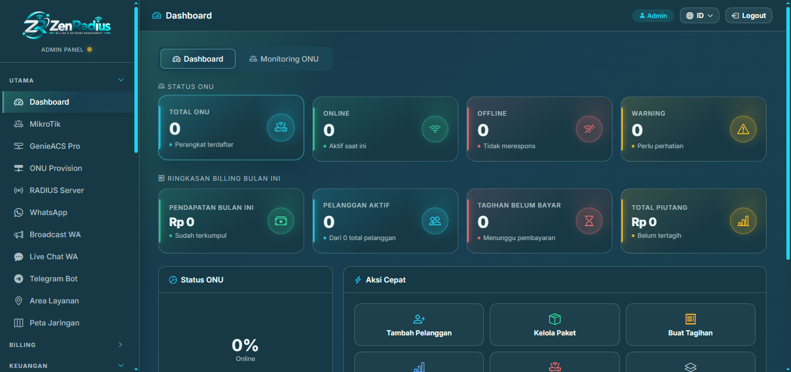
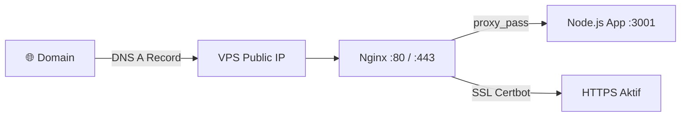
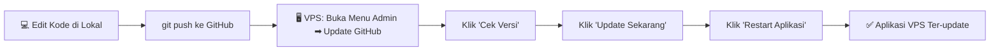

<div align="center">

# ZenRadius

**One Platform for Your Network** 🚀

Platform manajemen billing ISP, otomasi jaringan Mikrotik, billing Hotspot/PPPoE, dan portal mandiri pelanggan (*Customer Self-Service*) — modern, responsif, dan siap produksi sebagai aplikasi web berbasis PWA (*Progressive Web App*).




</div>

---

## 📖 Daftar Isi

- [Fitur Utama](#-fitur-utama)
- [Tumpukan Teknologi](#-tumpukan-teknologi)
- [Persyaratan Sistem](#-persyaratan-sistem)
- [Panduan Instalasi](#-panduan-instalasi)
- [Menjalankan via Docker](#-menjalankan-via-docker-alternatif)
- [Konfigurasi Domain & HTTPS](#-konfigurasi-domain--https)
- [Auto-Start Setelah Reboot Server](#-auto-start-setelah-reboot-server)
- [Update Aplikasi](#-update-aplikasi-setelah-deploy-ke-vps)
- [Akun Akses Default](#-akun-akses-default)
- [Lisensi](#-lisensi)

---

## ✨ Fitur Utama

### 🌐 Otomasi & Manajemen Jaringan (Mikrotik Integration)
| Fitur | Deskripsi |
|---|---|
| **PPPoE & Hotspot Billing** | Manajemen pembuatan voucher Hotspot otomatis (harian, mingguan, bulanan) dan akun PPPoE terpadu langsung dari dasbor administrasi. |
| **Isolir Otomatis** | Penangguhan otomatis akses internet pelanggan saat masa aktif paket berakhir, lengkap dengan pengalihan (*routing redirection*) menuju halaman Isolir. |
| **Auto-Polling Realtime** | Sinkronisasi status pembayaran QRIS yang andal untuk pembukaan isolir instan tanpa campur tangan admin. |

### 👤 Portal Pelanggan Terpadu (Customer Self-Service)
| Fitur | Deskripsi |
|---|---|
| **Simulasi Cerdas** | Membantu calon pelanggan menemukan paket internet (Normal, Streaming, Gaming, Bisnis) sesuai kebutuhan perangkat. |
| **Cek Tagihan Mandiri** | Akses instan untuk memeriksa invoice dan melakukan pembayaran via QRIS Statis maupun Virtual Account. |
| **Asisten Obrolan AI** | Chatbot responsif yang disematkan langsung di portal pelanggan untuk bantuan instan 24/7. |

### 📱 Progressive Web App (PWA)
Mendukung instalasi mandiri (*standalone mode*) ke layar beranda perangkat mobile/desktop dengan branding sesuai peran pengguna:

| Peran | Nama Aplikasi |
|---|---|
| Pelanggan | **ZenRadius Client** |
| Administrator | **ZenRadius Admin** |
| Teknisi Lapangan | **ZenRadius Teknisi** |
| Reseller / Mitra | **ZenRadius Reseller** |
| Kolektor Keuangan | **ZenRadius Kolektor** |

Aset statis di-cache menggunakan strategi **Stale-While-Revalidate** untuk pengalaman akses yang instan tanpa jeda pembersihan berkas oleh pengguna akhir.

---

## 🛠 Tumpukan Teknologi

| Komponen | Teknologi |
|---|---|
| **Runtime** | Node.js v18+ |
| **Backend Framework** | Express.js |
| **Templating** | EJS |
| **Database** | SQLite 3 (`better-sqlite3`) |
| **UI Framework** | Bootstrap 5.3 + Bootstrap Icons |
| **PWA** | Service Worker + Web App Manifest |
| **Integrasi Jaringan** | Mikrotik RouterOS API |

---

## 💻 Persyaratan Sistem

| Kebutuhan | Spesifikasi |
|---|---|
| **Sistem Operasi** | Windows 10/11, Windows Server, atau Linux (Ubuntu/Debian) |
| **Runtime** | [Node.js](https://nodejs.org/) v18.x atau lebih baru (LTS direkomendasikan) |
| **Database** | SQLite 3 (via `better-sqlite3`) |
| **Reverse Proxy (Opsional)** | Nginx atau Apache (untuk SSL/HTTPS & sertifikat PWA) |
| **Hardware Minimum** | 1 vCPU, 1 GB RAM, 10 GB Storage |

---

## 📥 Panduan Instalasi

### 1️⃣ Clone Repositori
```bash
git clone https://github.com/zenradius/zenradius.git
cd zenradius
```

### 2️⃣ Pasang Dependensi
```bash
npm install
```

### 3️⃣ Konfigurasi Environment
Salin `.env.example` menjadi `.env`:
```bash
cp .env.example .env    # Linux/Mac
copy .env.example .env  # Windows CMD/PowerShell
```

Sesuaikan nilai kredensial pada berkas `.env`:
```dotenv
MASTER_ADMIN_USERNAME=zenradius
MASTER_ADMIN_PASSWORD=zenradius123
MY_WEBHOOK_SECRET=Qris-Statik-key
PORT=3001
```

### 4️⃣ Verifikasi Database
```bash
node scripts/verify-database.js
```

### 5️⃣ Jalankan Aplikasi
```bash
# Mode Development (hot-reload)
npm run dev

# Mode Production
npm start
```

Aplikasi dapat diakses melalui: **`https://yourdomain.com`** (atau port kustom yang telah Anda tentukan).

---
## 🐳 Menjalankan via Docker (Alternatif)

Selain instalasi manual di atas, ZenRadius juga sudah menyediakan `Dockerfile` dan `compose.yaml` sehingga Anda bisa menjalankan aplikasi tanpa perlu memasang Node.js secara langsung di server.

### Persyaratan
* [Docker Engine](https://docs.docker.com/engine/install/) v20+
* [Docker Compose](https://docs.docker.com/compose/install/) v2+ (biasanya sudah bundel dengan Docker Desktop / `docker compose` plugin)

### Langkah 1: Clone Repositori
```bash
git clone https://github.com/zenradius/zenradius.git
cd zenradius
```

### Langkah 2: Konfigurasi Environment
```bash
cp .env.example .env    # Linux/Mac
copy .env.example .env  # Windows CMD/PowerShell
```
Sesuaikan nilai `.env` sesuai kebutuhan (kredensial admin, secret webhook, port, dll).

### Langkah 3: Build & Jalankan Container
```bash
docker compose up -d --build
```
Perintah ini akan:
* Build image dari `Dockerfile` (Node.js 20 + dependency native seperti `better-sqlite3`)
* Menjalankan container `zenradius-app` di background (`-d`)
* Mem-bind port `127.0.0.1:3001` ke container (gunakan reverse proxy Nginx/Apache untuk expose ke publik dengan HTTPS)
* Mount volume persisten: `settings.json`, `database/`, `data/`, `public/uploads/`, `auth_info_baileys/` — sehingga data **tidak hilang** saat container di-rebuild
* Menjalankan **health check** otomatis ke endpoint `/health` setiap 30 detik

### Langkah 4: Verifikasi Container Berjalan
```bash
docker compose ps
docker compose logs -f zenradius
```
Aplikasi dapat diakses melalui **`https://yourdomain.com`** (setelah dikonfigurasi reverse proxy) atau `http://127.0.0.1:3001` secara lokal di server.

### Perintah Operasional Umum
| Aksi | Perintah |
|---|---|
| Hentikan container | `docker compose down` |
| Restart container | `docker compose restart zenradius` |
| Lihat log real-time | `docker compose logs -f zenradius` |
| Masuk ke shell container | `docker compose exec zenradius sh` |
| Update ke versi terbaru | `git pull && docker compose up -d --build` |

> 💡 **Tip:** Jika menggunakan fitur **Update GitHub** di panel admin saat berjalan via Docker, pastikan container memiliki akses `git` dan proses restart dilakukan melalui `docker compose restart zenradius` (bukan PM2), karena aplikasi di dalam container tidak dikelola oleh PM2.

---

## 🌐 Konfigurasi Domain & HTTPS

Secara default aplikasi hanya berjalan di `127.0.0.1:3001` (baik mode manual maupun Docker) — **belum otomatis** dapat diakses via domain custom. Diperlukan **reverse proxy + SSL** agar aplikasi bisa diakses publik melalui `https://yourdomain.com` dan agar fitur PWA (install ke home screen) dapat berfungsi (PWA mewajibkan HTTPS).



### 1️⃣ Arahkan Domain ke VPS (DNS)
Di panel DNS domain Anda (Cloudflare, Niagahoster, dll), buat record:
```
Type: A
Name: @ (atau subdomain, misal: app)
Value: <IP_Publik_VPS_Anda>
```

### 2️⃣ Pasang & Konfigurasi Nginx (Reverse Proxy)
```bash
sudo apt update && sudo apt install nginx -y
```

Buat berkas konfigurasi baru `/etc/nginx/sites-available/zenradius`:
```nginx
server {
    listen 80;
    server_name yourdomain.com www.yourdomain.com;

    location / {
        proxy_pass http://127.0.0.1:3001;
        proxy_http_version 1.1;
        proxy_set_header Upgrade $http_upgrade;
        proxy_set_header Connection 'upgrade';
        proxy_set_header Host $host;
        proxy_set_header X-Real-IP $remote_addr;
        proxy_set_header X-Forwarded-For $proxy_add_x_forwarded_for;
        proxy_set_header X-Forwarded-Proto $scheme;
        proxy_cache_bypass $http_upgrade;
    }
}
```

Aktifkan konfigurasi:
```bash
sudo ln -s /etc/nginx/sites-available/zenradius /etc/nginx/sites-enabled/
sudo nginx -t
sudo systemctl reload nginx
```

### 3️⃣ Aktifkan HTTPS (SSL Gratis via Let's Encrypt)
```bash
sudo apt install certbot python3-certbot-nginx -y
sudo certbot --nginx -d yourdomain.com -d www.yourdomain.com
```
Certbot otomatis memperbarui konfigurasi Nginx untuk HTTPS dan mengelola **auto-renewal** sertifikat setiap ± 60 hari.

### 4️⃣ Perbarui Variabel Environment
Pastikan nilai terkait URL aplikasi pada `.env` menggunakan domain HTTPS final, misalnya:
```dotenv
APP_URL=https://yourdomain.com
```

> ✅ **Setelah setup ini dilakukan satu kali**, domain akan otomatis tetap berfungsi setiap kali VPS/container restart — Nginx dan sertifikat SSL berjalan sebagai service permanen di VPS, tidak perlu diulang manual.

---

## � Auto-Start Setelah Reboot Server

Agar aplikasi **otomatis kembali berjalan** saat VPS mati listrik/direstart, konfigurasi berikut wajib disiapkan sesuai metode deploy yang digunakan.

| Metode Deploy | Otomatis Jalan Saat Server Reboot? |
|---|---|
| **Docker Compose** (`restart: unless-stopped`) | ✅ Ya, otomatis (asalkan Docker service ter-enable) |
| **Manual (`npm start`)** | ❌ Tidak — aplikasi mati total, perlu start manual |
| **PM2** (`pm2 startup` + `pm2 save`) | ✅ Ya, setelah setup sekali |

### 🐳 Opsi A: Docker Compose (Direkomendasikan)
`compose.yaml` sudah dikonfigurasi dengan `restart: unless-stopped`, sehingga container otomatis restart saat crash maupun saat server reboot — asalkan **Docker daemon** sendiri otomatis aktif saat boot:
```bash
sudo systemctl is-enabled docker
# jika hasilnya belum "enabled":
sudo systemctl enable docker
```
Tidak ada langkah tambahan lain — setelah ini, aplikasi akan otomatis hidup kembali tanpa intervensi manual.

### ⚙️ Opsi B: Instalasi Manual dengan PM2
Jika aplikasi dijalankan langsung via Node.js (bukan Docker), gunakan **PM2** sebagai process manager agar tetap hidup dan otomatis restart saat boot:
```bash
npm install -g pm2
pm2 start app-customer.js --name zenradius
pm2 save
pm2 startup
```
Perintah `pm2 startup` akan menampilkan satu baris perintah `sudo` — jalankan perintah tersebut satu kali untuk mendaftarkan PM2 sebagai service sistem (systemd).

### ✅ Verifikasi
Uji dengan me-reboot server:
```bash
sudo reboot
```
Setelah server kembali online, cek status:
```bash
# Docker
docker compose ps

# PM2
pm2 list
```
Aplikasi seharusnya berstatus **running** tanpa perlu login/start ulang secara manual.

---

## �🔄 Update Aplikasi (Setelah Deploy ke VPS)

ZenRadius memiliki fitur **Update GitHub** bawaan di panel admin, sehingga Anda **tidak perlu SSH manual** setiap kali ada perubahan kode. Alurnya:



### Syarat Awal di VPS (Sekali Setup)
Pastikan aplikasi di VPS berjalan dari hasil `git clone`, **bukan** hasil upload manual/zip:
```bash
cd /path/to/zenradius
git remote -v   # pastikan menunjuk ke https://github.com/zenradius/zenradius.git
```
Jika belum, clone ulang dan pindahkan folder `database/`, `.env`, `public/uploads`, serta `auth_info_baileys` (sesi WhatsApp) ke lokasi hasil clone.

### Langkah Update via Panel Admin
1. **Di lokal:** selesaikan perubahan, lalu jalankan:
   ```bash
   git add .
   git commit -m "deskripsi perubahan"
   git push
   ```
2. **Login ke Panel Admin VPS** → buka menu **☁️ Update GitHub** (`/admin/update`).
3. Klik **Cek Versi** — sistem akan membandingkan `version.txt` lokal VPS dengan `origin/<branch>` di GitHub.
4. Jika status menunjukkan **"Ada update"**, klik **Update Sekarang**.
   * Sistem otomatis **backup** file penting (`settings.json`, `.env`, `database/`, `public/uploads`, `public/img`, `data`, sesi WhatsApp) sebelum menarik kode terbaru.
   * Kode ditarik via `git reset --hard origin/<branch>`, lalu file yang di-backup dikembalikan.
   * Jika `package.json` berubah, `npm install` otomatis dijalankan.
5. Setelah proses selesai, klik **Restart Aplikasi** agar perubahan diterapkan (proses PM2/Node di-restart otomatis oleh sistem).

> 💡 **Tip:** Gunakan bagian **Official Release Channel** di halaman yang sama jika ingin proses update yang lebih ketat (verifikasi checksum/signature rilis resmi) dengan restart otomatis + health check pasca-update.

> ⚠️ **Catatan:** Pastikan koneksi internet VPS stabil selama proses update berlangsung, dan hindari menutup halaman sebelum status menunjukkan selesai.

---

## 🔐 Akun Akses Default

Gunakan kredensial berikut untuk login pertama kali ke **Pusat Administrasi ZenRadius**:

| Item | Nilai |
|---|---|
| **URL Login** | `https://yourdomain.com/admin/login` |
| **Username** | `zenradius` |
| **Password** | `zenradius123` |

> ⚠️ **Penting:** Segera ubah kredensial default ini melalui menu pengaturan dasbor admin setelah berhasil masuk, demi keamanan basis data dan router Mikrotik Anda.

---

## 📝 Lisensi

Diterbitkan di bawah lisensi proprietari ZenRadius. Hak Cipta dilindungi Undang-Undang.

<div align="center">

**Ditenagai oleh ZenRadius — All Rights Reserved**

</div>
